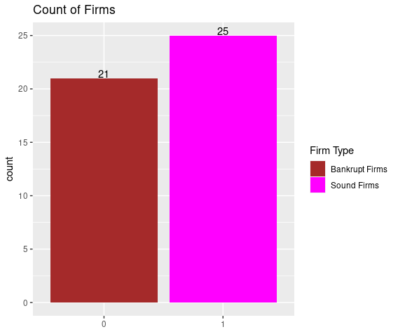
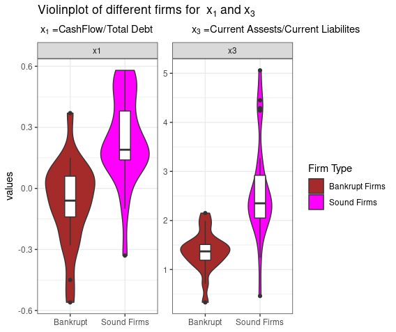
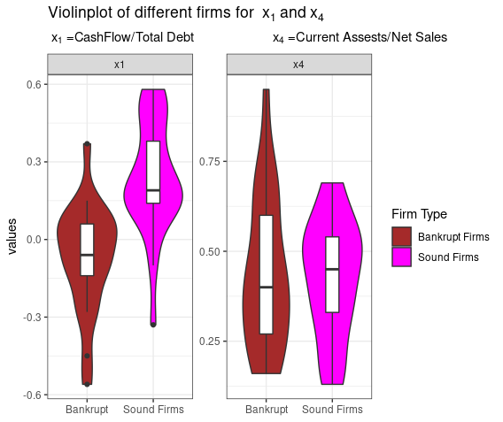
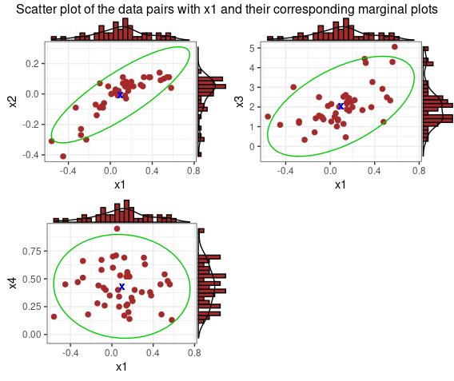

# Bankruptcy-classification
Annual financial data are collected for bankrupt firms approximately 2 years prior to their bankruptcy and for financially sound firms at about the same time. The data on four variables, X1=CF/TD(cash flow)/(total debt), X2=NI/TA(net income/total assets), X3=CA/CL(current assets/current liabilities), and X4= CA/NS(current assets)/(net sales).

### EDA

Nearly equal number of firms are taken for both the classes.

--------------------------------------------------------------------------------------------------------------------------------------------------------------------
Taking x3 and x4 with x1 to see which variable will have most effect on classification.

x1 and x3 will be a better classifier than x4

--------------------------------------------------------------------------------------------------------------------------------------------------------------------

Assumption of bivariate normality

Data is scattered nearly equally around the mean and the data falls under gaussian ellipse under 95% confidence and the univariates are also look like normal. Hence there is no reason to deny that the data pairs are not bivariate normal.

## To see further analysis run the codes.
